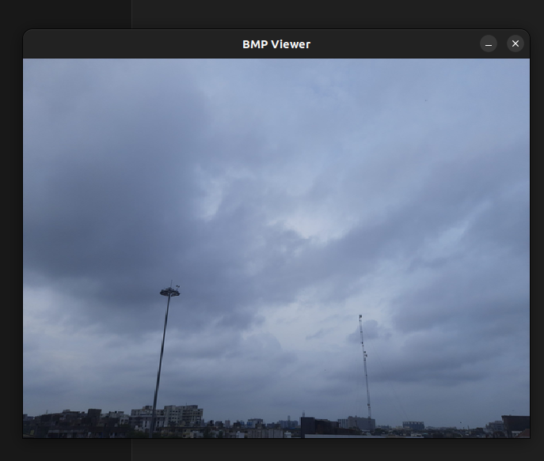

# BMP Image Drawer(Ubuntu 22.04LTC)

## Dependency

```bash
sudo apt-get install libsdl2-dev libsdl2-image-dev
```

## Build
```bash
mkdir build && cd build/
cmake ..
make -j
```

## Example of use
```bash
./drawBmp bmp/qwe.bmp
```
